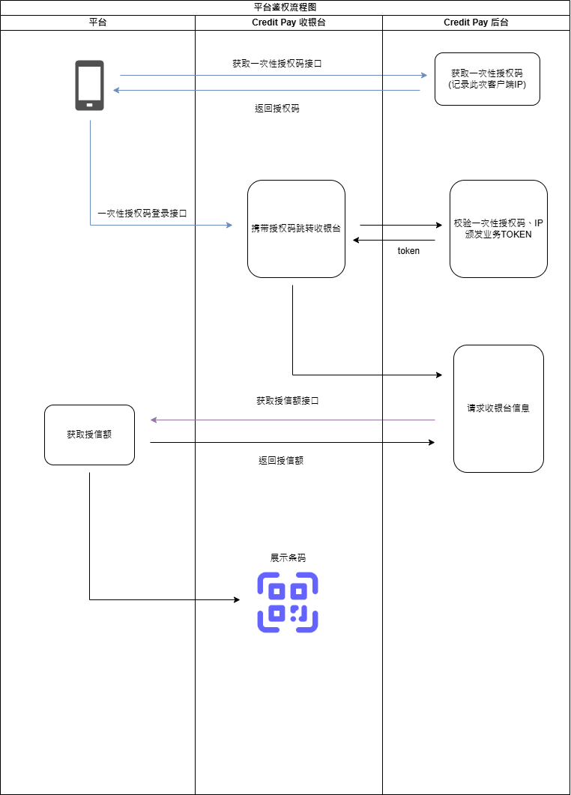

 

## 鉴权流程图

:::tip
平台与Credit Pay的所有API交互都需要进行身份验证。  
* [API Key](auth)
* [HMAC 签名](auth)
:::

## 鉴权登录
平台接入Credit Pay，需要接入以下接口  
[获取一次性授权码](./apis/platform-identify.md)  
[一次性授权登录](./apis/identify-redirect.md)

## 授信额度
完成登录后，会自动跳转收银台。  
跳转收银台过程中，Credit Pay会向平台请求授信额度，平台方需要返回授信额度。  
:::warning
平台需要自行实现授信额接口，供Credit Pay调用。
:::
[返回授信额度](./actions/get-credit-limit.md)

## 通知Webhook
业务流程中，Credit Pay会向平台方发送通知，平台方需要实现webhook接受通知。
:::warning
业务事件将通过POST请求发送到平台方指定的webhook地址，平台方需要自行实现webhook接收。
:::
[Webhook](./webhooks/events.md)

